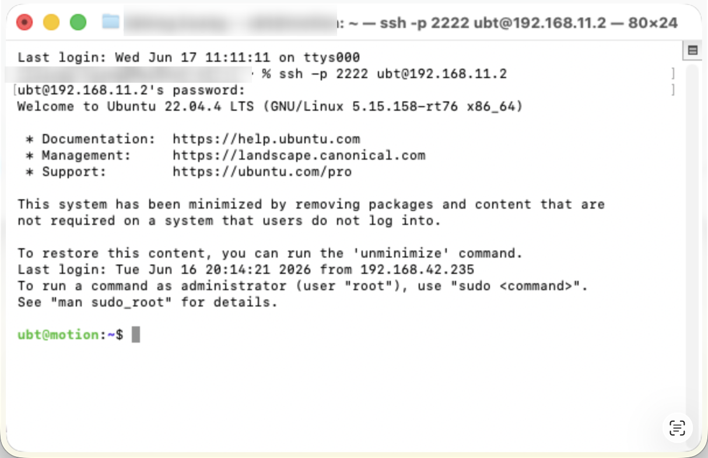
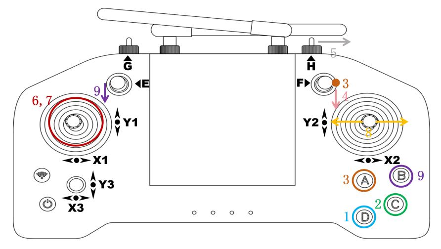

# 机器人开机与任务前置检查

本文面向 Walker S2 真机操作员。每次上电后，必须先完成人工回零和站立确认，再启动导航、
抓取或放置任务。任何一项未通过，都不得用程序命令绕过。

> **本项目现场约定：遥控器 回到零位，遥控器 切换到站立。** 

## 1. 上电前环境检查

- 操作员和安全监护员均已到位；无关人员退出机器人行走路线以及腿部、双臂、头部和载荷的
  完整运动包络。
- 地面平整、干燥、无散落物和线缆；机器人周围保留足够的回零、起身和失衡处置空间。
- 机器人外观、关节、线缆、连接器和电源部件无明显松脱、破损、挤压或异物；发现异常时
  不得上电。
- 导航路线、抓取台、放置台和箱体均已固定，现场与本次地图、点位、桌高和箱型配置一致。
- 遥控器可用并由操作员持有；现场批准的硬停/急停手段可立即触达，监护员知道何时使用。
- 已明确现场批准的停机、故障恢复和关机流程。不得把关闭终端、停止代理或 `Ctrl+C` 当作
  急停或断电手段。

### 1.1开机上电

- 上电前确保机器人挂在支架上：机器人双足自然下垂，展架升到最高，以确保腿复位过程脚掌不会碰触地面和其他物体。确保机器人双臂自然下垂，肘内侧和掌心朝前方，头朝下前方，背部急停按钮处于松开状态，电池已经插好。
- 依次操作 2 块电池处于开启状态，长按电池电源按键，直到指示灯亮起。
- 打开机器人背部盖板，按下机器人背部电源开关。


- 长按机器人背部的启动键，看到机器人头部显示屏亮起后表示机器人已开始启动，启动时间约1分钟。


- 按下机器人背部伺服控制按键，听到风扇声音响起，机器人开机完成。


### 1.2 连接机器人

1. 以太网线连接Walker S2机器人：使用网线与机器人以太网口连接

2. 接着打开网络设置，找到机器人所连接的网卡，进入 IPv4 ，将 IPv4 方式改为手动，地址设置为192.168.11.99，子网掩码设置为255.255.255.0，完成后点击应用，等待网络重新连接.

3. 通过SSH，在PC1或PC2登录ROS 2容器并运行Demo程序或者自定义程序 `ssh ubt@192.168.11.23 -p 2222` 密码请向您的技术支持人员获取。



### 1.3 关机 与 急停
- 关机： 短按下 + 长按关机 电源 启动键 关机
- 急停： 按下红色 按钮急停 机器人进入僵停，需要重新伺服 回零 才能继续使用

### 2.1 遥控器  回零 → 站立

上电后先等待设备完成启动和自检。出现告警、异常声响、异味、冒烟、部件松动或非预期动作
时，立即停止后续操作，隔离运动区，并按现场批准的安全流程处置。



*图：遥控器 D 键与 A 键的位置；本项目按 D 回零、按 A 站立。*

- **回零** 需要把机器人吊高，双腿有完全伸直再弯曲的动作
- **站立** 需要把机器人双脚落地，不然有双腿乱蹬的情况

| 顺序 | 操作 | 成功判断 | 未通过时 |
| ---: | --- | --- | --- |
| 1 | 按遥控器 **F下** + **D 键**，使机器人回到零位 | 双腿完全伸直再弯曲；手臂往外微微张开；听到语音`机器人启动成功` | 不按 A，不启动任何任务；按现场流程排查或恢复 |
| 2 | 确认回零成功后，按遥控器 **H 中** + **A 键**切换到站立 | 机器人完成起身；双脚支撑稳定，机身保持站立 | 禁止导航、抓放和任何程序动作；按现场流程安全处置 |
| 3 | 由操作员和监护员共同确认稳定站立 | 机器人静止且站立状态持续稳定，周围运动区仍保持清空 | 未获得共同确认不得继续 |

只有第 1～3 步全部通过，才可进行后续 ROS、运控、代理和感知检查。每次重新上电、异常恢复
或无法确认当前状态时，都应从本节重新开始，不得跳步。

## 3. 开机后的最小软件检查

先确认运控已按现场部署方式启动且无告警，再在已加载 ROS 2 和本工作区环境的终端执行以下
只读检查。命名空间或代理地址与现场不同时，使用本次部署的实际值。

### 3.1 ROS 与运控状态

```bash
ros2 topic echo /mc/joint_states --once
```

成功判断：命令能及时返回当前关节状态，数据完整且时间有效；运控无故障或持续告警。无数据、
数据不完整、状态过期或有运控告警时，不得执行任务。

### 3.2 HTTP 运动代理

```bash
curl_args=(-fsS)
if [[ -n "${MOTION_PROXY_API_KEY:-}" ]]; then
  curl_args+=(-H "X-API-Key: ${MOTION_PROXY_API_KEY}")
fi
curl "${curl_args[@]}" "${MOTION_BASE_URL}/healthz"
```

成功判断：使用现场已配置的 `MOTION_BASE_URL` 能得到健康响应。健康检查只证明代理进程可达，
不证明运控、动作安全或机器人已经到位；失败时不得发送动作请求。代理部署与排查见
[HTTP 运动代理启动指南](./3.HTTP运动代理启动指南.md)。

### 3.3 感知、TF 与任务接口

```bash
ros2 topic type /sensor/camera/stereo/pointcloud/raw
ros2 topic echo /sensor/camera/stereo/pointcloud/raw --once --field header
ros2 run tf2_ros tf2_echo base_footprint base_link
ros2 action info /demo3/box_grasp_demo/detect_box
ros2 service type /demo3/box_grasp_demo/suggest_crouch
ros2 service type /demo3/arm_ik/compute_place_ik
```

成功判断：点云类型正确且时间戳持续更新，所需 TF 可查询，DetectBox action 与两个 service
均存在，感知/IK 启动终端无持续报错。任一接口缺失、TF 中断、点云异常或 IK 未就绪时，
禁止执行导航抓放任务。

## 4. 任务放行与异常处置

仅当以下条件同时满足，才可按照
[地图导航抓放集成指南](./2.地图导航抓放集成指南.md)或
[抓取与放置操作指南](./4.抓取与放置操作指南.md)启动任务：

- 上电前环境检查完成；
- 已严格按 **D 回零 → A 站立** 执行，并确认机器人稳定站立；
- ROS、运控、代理、感知、TF 和任务接口的最小检查全部通过；
- 地图、点位、桌高、箱型、路线及现场安全条件已按对应任务指南复核。

运行中出现告警、失稳、异常运动、碰撞趋势、人员进入运动区、通信状态不明或命令超时，
应立即禁止后续任务命令。危险情况下使用现场已验证的硬停/急停；不要依赖 `Ctrl+C`、停止
HTTP 代理或关闭客户端撤回已经下发的动作。急停后的恢复以及关机、断电，仅由有权限人员
按照现场批准的流程执行；机器人未确认静止和安全前，不得接近、扶持或重新上电。
