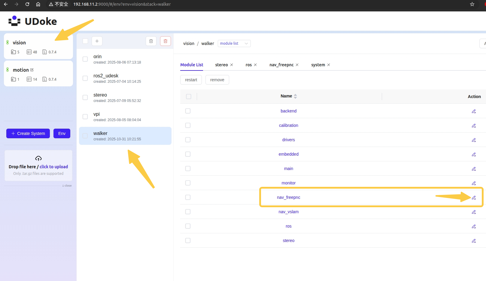

# AB点全流程导航SOP

# 修订历史

|版本|修订内容|日期|修订人|
|---|---|---|---|
|v1\.0\.0|添加准备, 启动流程|2025\-10\-24|Loong|

## 一\. 启动前准备

1. 完成标定: 标零，双目标定，四目标定

2. 导入地图

3. **开启录包功能**: 

    1. 进入udoke  http://192\.168\.11\.2:9000/,  用户名：`walker` 密码：请向您的技术支持人员获取

    
    2. 点击左侧vision, 点击freepnc设置按钮, 将`record_enable: `disable , 修改为enable, 点击部署




    3. 设置成功后每执行一次ab点搬运,将在`/etc/walker/log/nav/` 目录下生成一个bag文件夹

`/etc/walker/log/nav/` 目录下生成一个bag文件夹 就包含点云数据

## 二\. 全流程启动

1. 流程:导航到A点取料箱搬至B点，再从B点搬至A点，全流程结束

2. 场景布置：两张高80cm的桌子，呈90度放置，距离65cm以上，桌子下放置两层料箱，上层料箱贴二维码，并且在A点桌面放置上放置料箱。地图二维码统一使用 [二维码.pdf](二维码.pdf)，打印时纸张选择 **A4**。

3. 起运控：航模F键往下\+D键

4. 建图\(若已导入跳过\)：起完运控后开始建图，地图名为yungu\_wrc，A点名为Box1,B点名为Put1，A点与B点位置为顺时针方向，尽量避免靠近白墙这种毫无特征的场景

5. 全流程启动：开机后第一次起全流程，G键往右再回拨，设置地图，播报导航定位成功后，E键往下\+G键往右再回拨开始正式搬箱流程，最多循环跑50次

6. 遥控器按键:

    1. A键：机器停止，且任务流停止

    2. H键往左：机器开始踏步

    3. A键\+F键往上\+C键：机器人锁位，可以直接吊起来

## 三\. 打点

使用web 进行打点 

地图二维码使用 [二维码.pdf](二维码.pdf) 打印，打印纸张选择 **A4**；现场布置、建图和打点应使用同一套二维码。

**注意**：打点脚尖距离二维码约60cm

[web导航系统 SOP](../web导航系统sop/web导航系统sop.md)

补充： 


打点后，umap文件会生成对应的点位内容，包含自由导航目标点信息和二维码精定位的信息


## 四\. UMAP 地图点

``` json
{
   "id" : "box1",
   "level" : 0,
   "mark_point" : {
      "accuracy_x" : 0.05,
      "accuracy_y" : 0.05,
      "accuracy_yaw" : 1.0001,
      "id" : "120",
      "point_x" : 0.3,
      "point_y" : 0.0001,
      "point_yaw" : 5.,
      "speed_x" : 0.05,
      "speed_y" : 0.05,
      "speed_yaw" : 0.3
   },
   "mode" : "logo_nav",
   "point_x" : 1.097378134727478,
   "point_y" : 0.015438309870660305,
   "point_yaw" : -0.047819647017360377,
   "speed_x" : 0.3,
   "speed_y" : 0.15,
   "speed_yaw" : 0.3,
   "type" : "precise_marker",
   "typepoint" : {
      "keyframe_index" : -1,
      "offset_theta" : 0,
      "offset_x" : 0.0001,
      "offset_y" : 0.0001
   }
},
{
   "id" : "mid1",
   "level" : 0,
   "mark_point" : {
      "accuracy_x" : 0.1,
      "accuracy_y" : 0.1,
      "accuracy_yaw" : 2.0,
      "id" : "false",
      "point_x" : 0.0001,
      "point_y" : 0.0001,
      "point_yaw" : 0.0001,
      "speed_x" : 0.3,
      "speed_y" : 0.05,
      "speed_yaw" : 0.3
   },
   "mode" : "logo_nav",
   "point_x" : 0.54092264175415039,
   "point_y" : 0.066049560904502869,
   "point_yaw" : -0.0054974088331722565,
   "speed_x" : 0.7,
   "speed_y" : 0.35,
   "speed_yaw" : 0.15,
   "type" : "precise_marker",
   "typepoint" : {
      "keyframe_index" : -1,
      "offset_theta" : 0,
      "offset_x" : 0.0001,
      "offset_y" : 0.0001
   }
},
{
   "id" : "put1",
   "level" : 0,
   "mark_point" : {
      "accuracy_x" : 0.05,
      "accuracy_y" : 0.05,
      "accuracy_yaw" : 1.0,
      "id" : "121",
      "point_x" : 0.3,
      "point_y" : 0.05,
      "point_yaw" : 5.,
      "speed_x" : 0.05,
      "speed_y" : 0.05,
      "speed_yaw" : 0.3
   },
   "mode" : "logo_nav",
   "point_x" : 0.66109293699264526,
   "point_y" : -1.0406389236450195,
   "point_yaw" : -1.6503134755086368,
   "speed_x" : 0.3,
   "speed_y" : 0.15,
   "speed_yaw" : 0.3,
   "type" : "precise_marker",
   "typepoint" : {
      "keyframe_index" : -1,
      "offset_theta" : 0,
      "offset_x" : 0.0001,
      "offset_y" : 0.0001
   }
}

```
