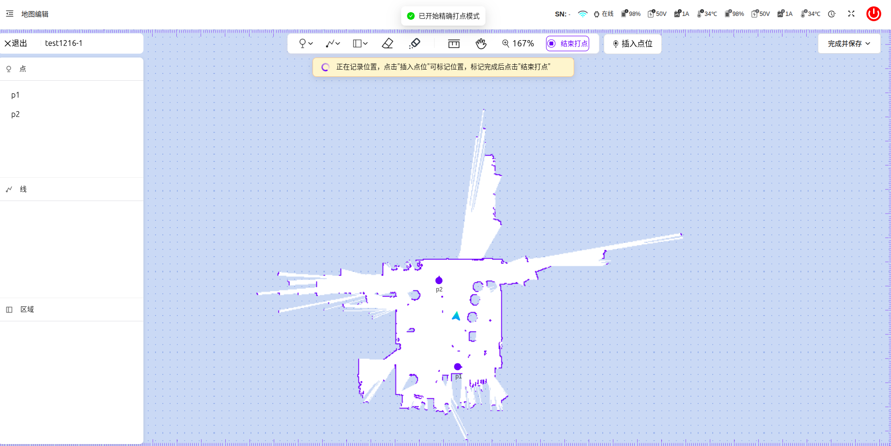

# web导航系统sop

此文档介绍了机器人本体调试 web 导航系统的基本使用，方便快速上手

# 前置准备

启动运控

# 建图

> 使用  `RTL8852BE` wifi 模块的机器在建大地图时请按以下方案建图

## 普通建图

点击创建地图

点击开始建图，并输入地图名称，点击保存后开始建图

建图开始并显示以下画面

点击结束建图来保存建图结果

## 取消建图

点击左上角退出按钮，并确认退出，将会取消建图并删除对应地图文件

## 推流画面

在右侧下拉框可选择对应话题查看推流画面

点击添加按钮可新增话题

> 话题名称：自定义输入
> 话题：对应的 topic
> 
> 新增话题保存在浏览器中
> 
> 

## 建图打点（仅限utars）

在建图过程中，点击左上角插入点位按钮，输入点的名称并保存，将机器人当前位姿保存为一个点。

## 增量建图

在地图更多菜单中点击增量建图

等待增量建图启动

目前增量建图只有 utars 有左侧栅格图，unova左侧显示为空

点击结束建图保存结果

# 地图管理

编辑地图：进入地图编辑页面

重命名：重命名地图

增量建图：基于当前地图进行增量建图

使用地图：调用设置地图

导出地图：将当前地图导出到本地

删除地图：删除所选地图

# 编辑地图

点击地图卡片上的编辑地图，会将这个地图设置为当前地图并进行重定位，成功后进入编辑页面

## 快捷操作

> 点击工具栏按钮进入编辑模式后再次点击可取消选中模式
> 
> 

|功能|操作|
|---|---|
|缩放|滚轮|
|移动视口|鼠标右键拖拽或者点击工具栏手形图表后左键拖拽|
|测距|点击工具栏尺子，然后点击地图任意点后测量点击点位到鼠标距离（单位：米）|
|删除元素|点击元素后按下delete键|

## 打点

### 手动打点

点击工具栏的打点按钮，点击地图任意位置，点击保存并输入点的名称

### 精确打点

点击工具栏的`精确打点`按钮进入精确打点模式，此时会在地图上显示机器人的位姿，点击工具栏右侧`插入点位`按钮，将机器人当前位姿保存为一个点

## 绘制虚拟墙或虚拟轨道

点击工具栏第二项的虚拟墙或虚拟轨道，在地图上任意位置多次点击生成路径，**双击**生成最后一个点并结束绘制

## 绘制区域

点击工具栏第三项可进行区域绘制，在地图上任意位置多次点击生成路径，**双击**生成最后一个点并闭合区域，结束绘制

## 编辑元素

点击地图上的任意元素或者点击左侧边栏的元素名词，可在右侧弹出框编辑元素属性
点击点可旋转修改方向

## 保存地图

保存地图：覆盖当前地图数据

另存为：生成新的地图文件

# 导航

进入导航页面，需要先设置地图并进行重定位，才能跳转到正式导航页面

**自动定位**：全局重定位
**局部定位**（仅限utars）：在地图点击机器人当前大致位置后，点击开始定位按钮，机器人会在点击的位置附近进行重定位

**强制定位**（仅限utars）：在地图点击机器人当前位置后，点击开始定位按钮，会强制认定机器人在点击的位置进行重定位

点击右侧添加点位，添加要导航的目标点位，点击开始导航后会按照添加的点位依次导航到目标点位

二维码点定位设置

# 异常处理

网页建图画面不刷新临时解决方案
使用 RTL8852BE wifi 模块的机器人，在网页建图过程中，当机器人到达 wifi 信号边界时会出现地图不刷新的现象，如下图所示：

通过网线连接用户笔记本以及机器人，断开电脑与机器人的 wifi，然后重新刷新网页端，开始建图。 注意机器建图时候会移动，建议网线稍微长一些（2-3米最佳），以免对电脑产生拉扯。有线连接设置如下：

> 类型规则
> 
> 自动：按目标点位依次导航，完成一轮后结束
> 
> 自定义：按目标点位依次导航，在间隔`循环间隔`的时间后根据`循环次数`重复之前的导航动作
> 
> 

> 轨道导航（仅限utars）：机器人会找到附近的轨道，在轨道上朝目标点位移动（机器人不会脱离轨道，会在距离目标点最近的轨道点停下）
> 
> 

